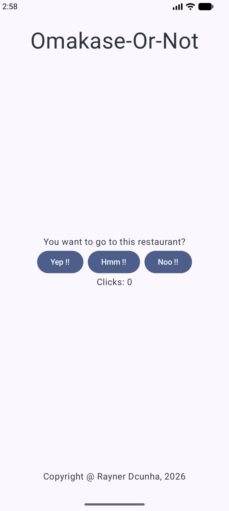
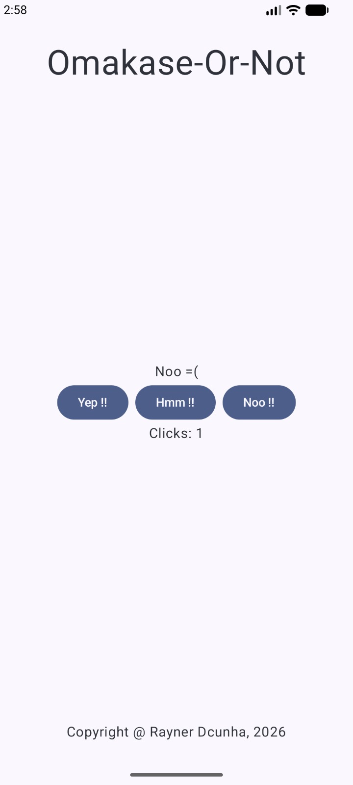
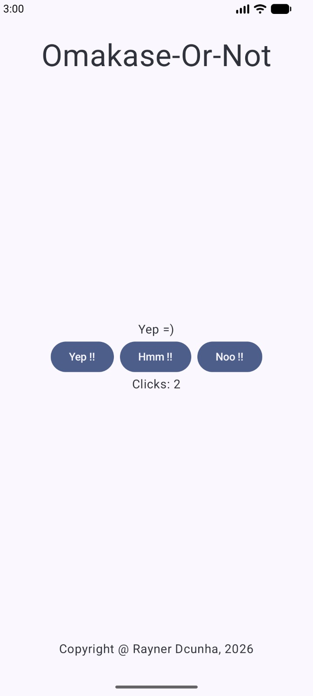

# 🍣 Omakase or Not?

> You want to go to this restaurant?

**Omakase or Not** is a simple Android application built with **Kotlin** and **Jetpack Compose** that turns a restaurant decision into a small interactive experience.

Instead of endlessly debating whether to go, just ask:

**Omakase or Not?**

---

## 📱 App

### Home Screen

<p align="center">
  
</p>

The app presents a restaurant decision with three possible responses:

- **Yep!!**
- **Hmm!!**
- **Noo!!**

Choose a response and see what happens.

---

## 🎲 Example Interactions

The outcome can vary between interactions, so these screenshots show examples from an actual run rather than a fixed sequence.

<p align="center">
  
  
</p>

---

## 🛠️ Built With

- **Kotlin**
- **Jetpack Compose**
- **Material 3**
- **Android SDK**
- **Gradle Kotlin DSL**

---

## Demo

<p align="center">
  
</p>)

---

## 🚀 Getting Started

### Clone the repository

```bash
git clone https://github.com/raynerdcunha/omakase-or-not.git
cd omakase-or-not
```

Open the project in **Android Studio**, allow Gradle to sync, and run the application on an Android emulator or physical Android device.

---

## 💡 About the Project

This project was built as a small exploration of **Android development with Jetpack Compose**, focusing on interactive UI, state changes, and a simple probability-based experience.

Sometimes you know where you want to eat.

Sometimes...

**you leave it to chance. 🍣**

---

## 📄 License

This project is licensed under the Apache License 2.0.

See [`LICENSE.md`](LICENSE.md) for more information.
